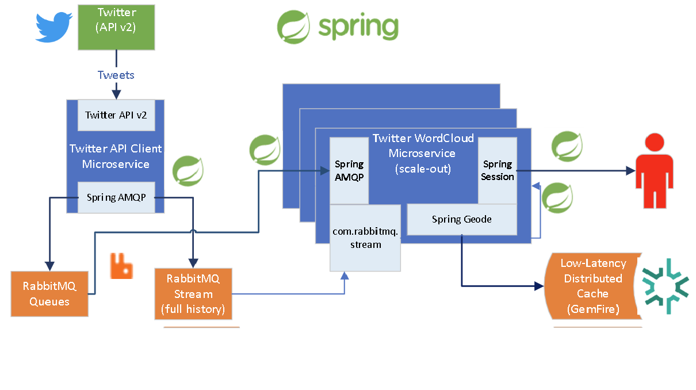

# Twitter Wordcloud generator in Spring Boot

Generate a wordcloud using Twitter v2 API. Purposed for learning spring boot, and cloud native development technologies from [VMware Tanzu](https://tanzu.vmware.com/tanzu).


Supports 2 modes
- Standalone mode
- Microservices mode

The following technologies are used.

- [Spring Boot](https://spring.io/projects/spring-boot)
- [Twitter API Client Library for Java](https://github.com/twitterdev/twitter-api-java-sdk)
- [Spring Cloud Bindings](https://github.com/spring-cloud/spring-cloud-bindings)
- [Kuromoji](https://github.com/atilika/kuromoji)
- [D3 Cloud](https://github.com/jasondavies/d3-cloud)
- [Clarity UI](https://clarity.design/)
- [React-toastify](https://fkhadra.github.io/react-toastify/introduction)

In addition, the following technologies are used for microservices mode
- [Spring Security OAuth2.0](https://spring.io/guides/tutorials/spring-boot-oauth2/)
- [Spring Cloud Sleuth](https://spring.io/projects/spring-cloud-sleuth)
- [RabbitMQ](https://www.rabbitmq.com/)
- [PostgreSQL](https://www.postgresql.org/)
- [GemFire](https://www.vmware.com/products/gemfire.html)


## Standalone mode

Standalone mode, supports running this application anywhere with only JVM installed.

### Architecture


Standalone mode runs in the following technologies

- Collect tweets based on configured search hashtags, and interval
- Store tweets on local database
- Creates a view application based on data queried from the database
- Provides one time access password to log into "Tweets" page

> :warning: Standalone mode does not support scaling out the application
### Prerequisite

- Java 11 (or above)
- [Twitter v2 API Bearer Token](https://developer.twitter.com/en/docs/authentication/oauth-2-0/bearer-tokens)

### How to run

```
export TWITTER_API_BEARER_TOKEN="AAAA...BSufQEAAAAAp9W..."
export TWITTER_HASHTAGS="#HASTHAG_TO_SEARCH"
git clone https://github.com/dmitrynovik/twitter-wordcloud
cd twitter-wordcloud
./mvnw install && ./mvnw spring-boot:run -pl wordcloud
```

### Caution

Running in several instances (aka scale out) in standalone will lead to the following.

- Multiple instances querying Twitter API may breach the [API limitation](https://developer.twitter.com/ja/docs/twitter-api/rate-limits)。
- No guarantee of all instances having the same data in database
- User login will not be consistent due to not having an external user database

## Microservices mode



In microservice mode we decouple the function in the following way

- TwitterAPIClient
  - To limit the amount of API calls against twitter, this is designed to only run in a single instance
  - Stores the tweet not in a database but instead to a RabbitMQ Queue
- ModelViewController(MVC)
  - Supports scaling out
  - Consumes queue generated from the TwitterAPI client
  - Updates/Reads from a single external Postgres database
  - User login performed by external OIDC identity provider
  - Store session cache on external Redis cache store

### Prerequisite

Additionally, to standalone mode prepare the following.

- RabbitMQ Cluster
- PostgreSQL Server
- GemFire
- OAuth2.0 Endpoint


### How to run
* Define the environment variable TWITTER_API_BEARER_TOKEN = (your Twitter API v2 bearer token. You need to regitster as Twitter developer to run this.)
* Prepare `application-twitterapiclient.properties` file.

```
## Mandatory
twitter.hash.tags="#HASTHAG_TO_SEARCH"
spring.rabbitmq.host=RABBITMQ_HOST
spring.rabbitmq.password=RABBITMQ_PASSWORD
spring.rabbitmq.port=RABBITMQ_PORT
spring.rabbitmq.username=RABBITMQ_USERNAME

## Optional
management.metrics.export.wavefront.api-token=WAVEFRONT_TOKEN
management.metrics.export.wavefront.uri=WAVEFRONT_URI
management.metrics.export.wavefront.enabled=true
wavefront.tracing.enabled=true
wavefront.freemium-account=false
```

Run the twitter-api client

```
./mvnw install && ./mvnw spring-boot:run -pl wordcloud -P twitterapiclient
```

Prepare `application-modelviecontroller.properties` 

```
## Mandatory
spring.rabbitmq.host=RABBITMQ_HOST
spring.rabbitmq.password=RABBITMQ_PASSWORD
spring.rabbitmq.port=RABBITMQ_PORT
spring.rabbitmq.username=RABBITMQ_USERNAME
spring.datasource.driver-class-name=org.postgresql.Driver
spring.datasource.password=POSTGRES_PASSWORD
spring.datasource.url=POSTGRES_URL
spring.datasource.username=POSTGRES_USERNAME
spring.r2dbc.url=POSTGRES_URI
spring.r2dbc.password=POSTGRES_PASSWORD
spring.r2dbc.username=POSTGRES_USERNAME
spring.data.gemfire.cache.name=Tweets
spring.data.gemfire.pool.locators=127.0.0.1[10334]


## Optional
management.metrics.export.wavefront.api-token=WAVEFRONT_TOKEN
management.metrics.export.wavefront.uri=WAVEFRONT_URI
management.metrics.export.wavefront.enabled=true
wavefront.tracing.enabled=true
wavefront.freemium-account=false
spring.redis.client-name={client-name}
spring.redis.cluster.max-redirects={cluster.max-redirects}
spring.redis.cluster.nodes={cluster.nodes}
spring.redis.database={database}
spring.redis.host={host}
spring.redis.password={password}
spring.redis.port={port}
spring.redis.sentinel.master={sentinel.master}
spring.redis.sentinel.nodes={sentinel.nodes}
spring.redis.ssl={ssl}
spring.redis.url={url}
```

Run the modelviewcontroller app.

```
./mvnw install && ./mvnw spring-boot:run -pl wordcloud -P modelviewcontroller
```
